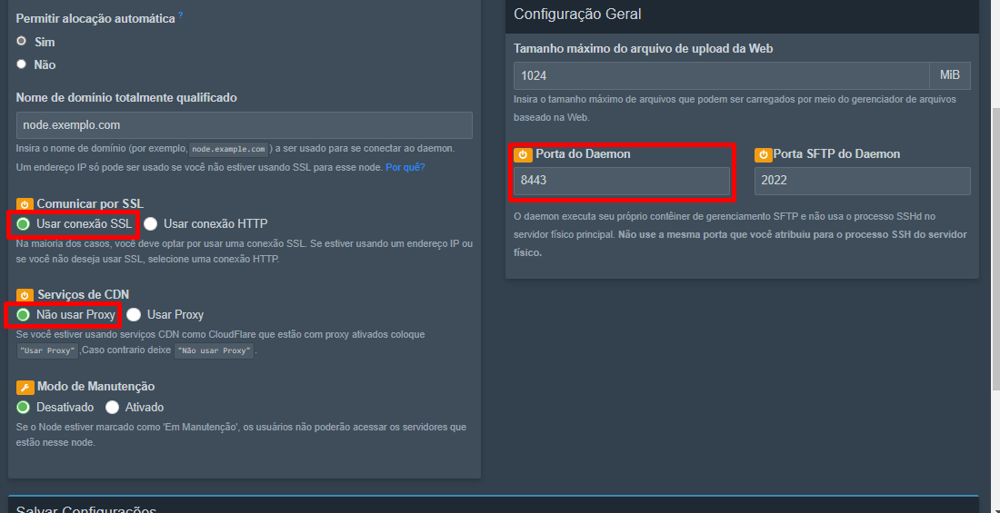

# Configurando Wings

## Configurar o sistema de segurança da CloudFlare SSL/TLS para as Wings

:::danger AVISO
Isto é uma continuação do [CloudFlare SSL/TLS](/docs/4%20-%20Guias%20Extras/1%20-%20CloudFlare%20CDN/completo-estrito.md), Configure ele primeiro antes de seguir com essa documentação, caso ja tenha feito então pode ignorar esse aviso.
:::

:::danger AVISO 2
Usar Proxy na Wings da segunrança, porém, o CloudFlare "Gratuito" só permite uma porta com proxy alteravel "8443", e devido a isso o "SFTP" Não funciona no "FQDN" Usado pelas wings, porém basta criar um dominio "A" Sem proxy, para poder usar o "SFTP" de outra forma, porém o recomendado mesmo é o uso do CloudFlare "Pago" para melhor segurança
:::

:::danger AVISO 3
Usar Proxy na Wings da segunrança, porém, o CloudFlare "Gratuito" só permite uma porta com proxy alteravel "8443", e devido a isso Usar o dominio do Node Não funciona no "IP alias" Usado pelas wings, porém basta criar um dominio "A" Sem proxy, para poder Usar o dominio do Node no "IP alias", de preferencia, use o "IP" da maquina.
:::

### Configurando as Wings

:::info Informação
Esta documentação é uma continuação da Instalação das [Wings](/docs/2%20-%20Pterodactyl/4%20-%20Wings/Instala%C3%A7%C3%A3o.md), só use essa documentação se ja tiver configurado o básico.
:::


Após ja ter um node, clique nele e haverá uma guia chamada Definições. Edite as configurações marcadas na Imagem a baixo. E Depois Salve as configurações.




##### Porta do Daemon

Altere a porta do daemon para "8433", a porta do Proxy da CloudFlare.

##### Comunicar por SSL

Deixe ativado essa função pois usaremos o certificado criado anteriormente.

##### Serviços de CDN

Isto não deve ser ativado, pois usaremos certificado do CloudFlare.


#### Configurando no Terminal

Para Iniciar, remova o antigo "config.yml"

```bash
rm /etc/pterodactyl/config.yml
```

Depois Salve e depois click em "Configuração", Copie e edite o diretório do certificado "cert:" e "key:" para o diretório do certificado do CloudFlare.

```bash
cert: /certificados/cert.pem
key: /certificados/key.pem
```


Digite no terminal o Seguinte Nano para criar a Nova "config.yml" em "/etc/pterodactyl" e cole o texto editado.

:::danger Aviso
O Botão "Gerar Token" não funciona nesse caso, faça isso manualmente
:::

```bash
nano /etc/pterodactyl/config.yml
```

### Iniciando Wings

Para iniciar o Wings, basta executar o comando abaixo, que o iniciará em um modo de depuração. Depois de confirmar que ele está sendo executado sem erros, use `CTRL + C` para encerrar o processo e daemonizá-lo seguindo as instruções abaixo. Dependendo da conexão de internet do seu servidor, puxar e iniciar o Wings pela primeira vez pode levar alguns minutos.

```bash
sudo wings --debug
```

Após Confirmar que está tudo certo com as wings, Digite o comando a baixo para reiniciar elas completamente.

```bash
systemctl restart wings
```

:::sucess Parabéns!
Agora seu Painel possue a Segurança do CloudFlare nas Wings.
Caso tenha encontrado algum Problema entre em contato no nosso [Discord](https://discord.gg/8r7n7mU33R).
:::